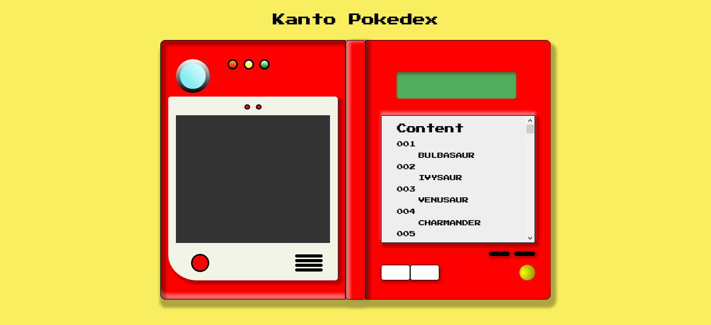
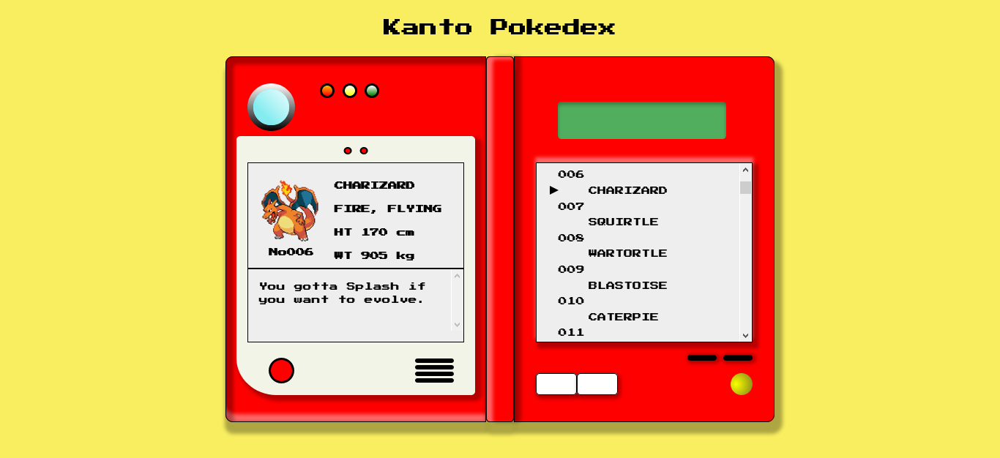

# Kanto Pokedex

My version of the Kanto Pokedex. This started out as a [practice exercise](https://github.com/laurielim/REACT21K_JAVASCRIPT/tree/main/js-with-hoang/day-10-poke-query) for my JavaScript class in the Full Stack Developer Program at Business College Helsinki. At that time, I had recently came across CSS Art and wanted to try it out. You can see the design elements on [Figma](https://www.figma.com/file/fTVPVJmNd89leqymL9o4Wy/pokedex-project?node-id=0%3A1) and a live demo on [CodePen](https://codepen.io/laurielim/pen/PoWVmgV).

## Technologies used

Built with:

- HTML
- CSS
- JS

## Sources

[Design Reference by Justin Mezzel](https://dribbble.com/shots/2908884-I-Saw-It-On-Twitch-Pokedex)
[Data from the PokéAPI](https://pokeapi.co/)

## Screenshot

### Screenshot of device while off

### Screenshot of device when Charizard is selected

